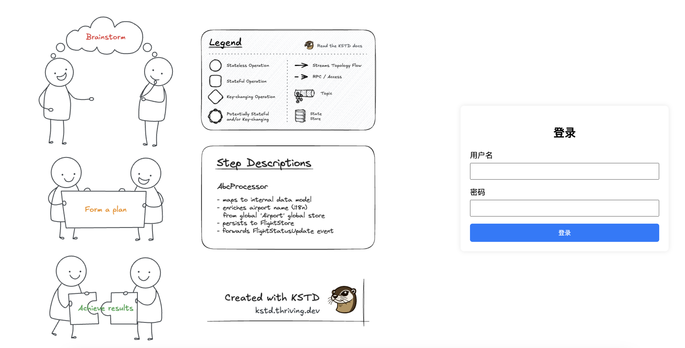
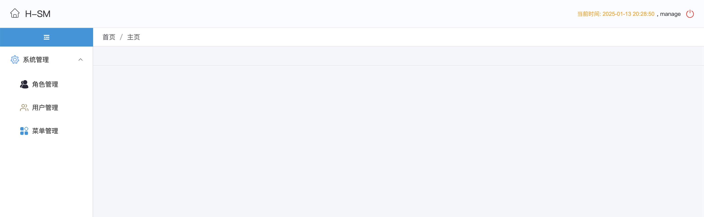
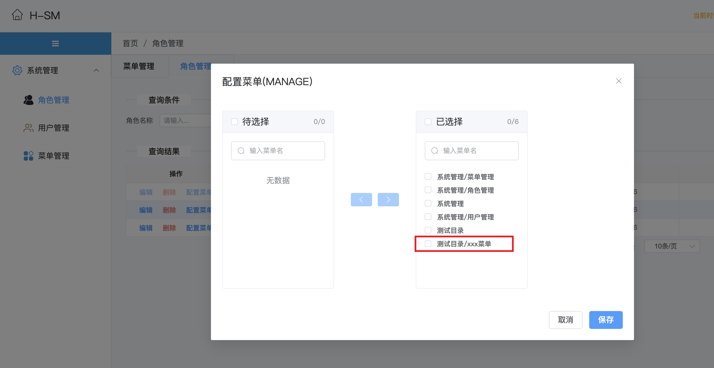

一个包含基本登录、注销、系统管理（角色、用户、菜单）的壳子，应用依赖后添加少量配置即可集成对应功能，适合于构建应用服务的后台管理维护相关功能。
A shell that includes basic login, logout, and system management (roles, users, menus). After the application dependency, a small amount of configuration can be added to integrate the corresponding functions. It is suitable for building background management and maintenance related functions of application services.

## 快速开始 (Quick Start)
```bash
git clone https://github.com/hbq969/h-sm.git
cd h-sm/src/main/resources/static
nvm use 16 
npm i && npm run build
cd h-sm 
mvn -U -DskipTests=true clean install
```


## 配置 (Config)

- 添加依赖

```xml
	<dependency>
    <groupId>com.github.hbq969</groupId>
    <artifactId>h-sm</artifactId>
    <version>1.0-SNAPSHOT</version>
  </dependency>
```


- 必要的配置

```yaml
server:
  servlet:
    context-path: /h-demo
    session:
      cookie:
        http-only: true
        max-age: ${spring.mvc.interceptors.login.cookie-max-age-sec}
        secure: false
        same-site: strict
        path: /
      timeout: 30m
spring:
  mvc:
    interceptors:
      api-safe:
        enabled: false
      login:
        enabled: true
        cookie-max-age-sec: 1800
        dialect: embedded
        include-urls:
          - "/hbq969-sm/**"
          - "/hbq969-dict/**"
          - "/hbq969-tabula/**"
          - "/common/encrypt/**"
          - "/ui-gw/**"
        exclude-urls:
          - "/**/error"
          - "/common/health"
          - "/hbq969-sm/index.html"
          - "/hbq969-sm/**/*.js"
          - "/hbq969-sm/**/*.css"
          - "/hbq969-sm/**/*.png"
          - "/hbq969-sm/**/*.jpg"
          - "/hbq969-sm/**/*.map"
          - "/hbq969-sm/**/*.ico"
          - "/hbq969-sm/**/login"
      resource-handler-registry:
        entries:
          - handlers: /hbq969-sm/**
            locations: classpath:/static/hbq969-sm/
        enabled: true
```


> 如果开启了登录、系统管理功能，最好api安全拦截器关闭，未开启登录、系统管理情况最好开启下api安全拦截器保证维护接口不要直接暴露

```yaml
spring:
  mvc:
    interceptors:
      api-safe:
        enabled: false
```


> 否则就开启api-safe
```yaml
spring:
  mvc:
    interceptors:
      api-safe:
        enabled: true
        # 需要保护的api接口，未开启登录功能时最好配置
        include-path-patterns:
          - "/hbq969-sm/**"
          - "/hbq969-dict/**"
          - "/hbq969-tabula/**"
          - "/common/encrypt/**"
          - "/ui-gw/**"
          - "/**/doc.html"
          - "/**/swagger-ui.html"
          - "/**/api-docs"
        header-name: api安全请求头名称
        header-value-regex: api安全请求头值
      login:
        enabled: false
      resource-handler-registry:
        entries:
          - handlers: /hbq969-sm/**
            locations: classpath:/static/hbq969-sm/
        enabled: true
```


## 功能演示 (Features)







## 如何添加菜单？(How add Menu?)

### Step 1： 创建`vue`视图模版

 创建 `src/main/resources/static/src/views/xxx/main.vue`，然后编写页面代码


### Step 2:  添加vue路由

```javascript
import {createRouter, createWebHashHistory} from 'vue-router'

const routes = [
    {
        path: '/xxx',
        component: () => import('@/views/xxx/main.vue')
    }
]

const router = createRouter({
    history: createWebHashHistory(process.env.BASE_URL),
    routes
})

export default router
```


### Step 3: 构建打包

```bash
npm run build
```

###   

### Step4: 添加菜单

> `h-demo`为`${server.servlet.context-path}`，`demo-ui`为`vue.config.js`中定义的`outputDir`

1. 添加菜单


2. 角色关联菜单




## 问题联系 (Contact)

[hbq969@gmail.com](mailto:hbq969@gmail.com)


## 许可 (License)

The MIT License (MIT)

Copyright (c) 2024 hbq969

Permission is hereby granted, free of charge, to any person obtaining a copy of
this software and associated documentation files (the "Software"), to deal in
the Software without restriction, including without limitation the rights to
use, copy, modify, merge, publish, distribute, sublicense, and/or sell copies of
the Software, and to permit persons to whom the Software is furnished to do so,
subject to the following conditions:

The above copyright notice and this permission notice shall be included in all
copies or substantial portions of the Software.

THE SOFTWARE IS PROVIDED "AS IS", WITHOUT WARRANTY OF ANY KIND, EXPRESS OR
IMPLIED, INCLUDING BUT NOT LIMITED TO THE WARRANTIES OF MERCHANTABILITY, FITNESS
FOR A PARTICULAR PURPOSE AND NONINFRINGEMENT. IN NO EVENT SHALL THE AUTHORS OR
COPYRIGHT HOLDERS BE LIABLE FOR ANY CLAIM, DAMAGES OR OTHER LIABILITY, WHETHER
IN AN ACTION OF CONTRACT, TORT OR OTHERWISE, ARISING FROM, OUT OF OR IN
CONNECTION WITH THE SOFTWARE OR THE USE OR OTHER DEALINGS IN THE SOFTWARE.
