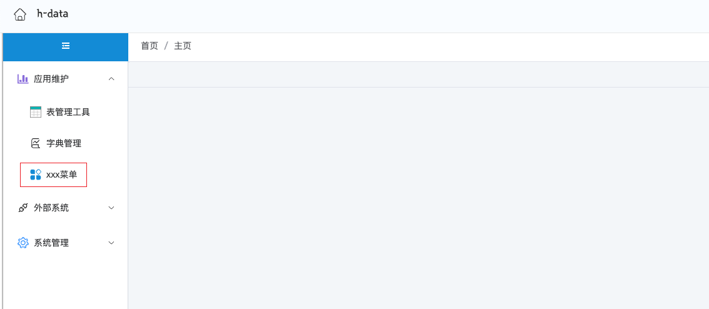

基于定制的脚手架快速生成`springboot`工程项目骨架代码和相关基础设施，使用脚手架工程模板主要作用是工程化规格化我们的项目工程，让开发团队都使用一套规约进行工程目录文件的维护。方便开发团队快速创建出统一风格的工程目录和代码模板，此版本基于`SpringBoot 2.7.18`版本，模版继承至h-parent这个父模版，类库的版本统一由h-parent进行维护，在自建模块中尽量少引入额外的类库。

Based on the customized scaffolding, the skeleton code and related infrastructure of the `springboot` project are quickly generated. The main purpose of using the scaffolding project template is to standardize our project engineering and let the development team use a set of specifications to maintain the project directory files. It is convenient for the development team to quickly create a unified style of project directory and code templates. This version is based on the `SpringBoot 2.7.18` version. The template inherits from the parent template h-parent. The version of the class library is uniformly maintained by h-parent. Try to introduce as few additional class libraries as possible in the self-built module.


```bash
git clone https://github.com/hbq969/h-archetype.git
```


```bash
cd h-archetype/target/generated-sources/archetype
mvn install
```


```bash
mvn archetype:generate \
-DinteractiveMode=false \
-DarchetypeGroupId=com.github.hbq969 \
-DarchetypeArtifactId=h-archetype \
-DarchetypeVersion=1.0-SNAPSHOT \
-DgroupId=com.github.hbq969 \
-Dversion=1.0-SNAPSHOT \
-DartifactId=h-example \
-Dpackage=com.github.hbq969 \
-Dproduct=code \
-Dmodule=example \
-DappPort=8080 \
-Dauthor=hbq969@gmail.com
```


|      **属性**       | **说明**                                                     |     **示例**      |
| :-----------------: | :----------------------------------------------------------- | :---------------: |
|  archetypeGroupId   | 骨架groupId                                                  | com.github.hbq969 |
| archetypeArtifactId | 骨架artifactId                                               |    h-archetype    |
|  archetypeVersion   | 骨架版本                                                     |   1.0-SNAPSHOT    |
|       groupId       | 待创建工程groupId                                            | com.github.hbq969 |
|     artifactId      | 待创建工程artifactId<br/>尽量使用code-sm        |     h-example     |
|       package       | 待创建工程的包名<br/>实际创建后包名<br/>com.github.hbq969.code.sm | com.github.hbq969 |
|       product       | 产品名称                                                     |       code        |
|       module        | 模块名称                                                     |      example      |
|       version       | 待创建工程版本                                               |   1.0-SNAPSHOT    |
|       appPort       | 微服务监听端口                                               |       8080        |
|       author        | 作者                                                         | hbq969@gmail.com  |


- 基础的系统模块功能
- 前端框架（登录页、主体页面框架）
- 字典管理功能
- 表管理功能


```yml
dict:
  enabled: true
  # 重载周期
  reload:
    cron: 0 */30 * * * *
  # 转义后字段前缀
  map-key-prefix: fmt
```


```yaml
tabula:
  enabled: true
  # 选择数据库类型
  dialect: mysql
  # 如果是mysql，schema即为database，如果是oracle，schema为用户
  schema: demo
  # 是否开启表数据修改
  open-edit-delete: true
```


```yaml
login:
  enabled: true
  # 会话Cookie失效时长
  cookie-max-age-sec: 1800
  # 不需要会话拦截的url，一般场景下将业务接口排除掉，登录功能尽量只拦截模块自身维护的接口
  exclude-urls:
    - "/**/*.js"
    - "/**/*.css"
    - "/**/*.png"
    - "/**/*.jpg"
    - "/**/*.map"
    - "/**/*.html"
    - "/**/*.ico"
    - "/**/login"
    - "/**/logout"
    - "/**/error"
  # 使用哪种数据库
  dialect: mysql
```


> 如果开启了登录、系统管理功能，最好api安全拦截器关闭，未开启登录、系统管理情况最好开启下api安全拦截器保证维护接口不要直接暴露

```yaml
spring:
  mvc:
    interceptors:
      api-safe:
        enabled: false
```


```yaml
spring:
  mvc:
    interceptors:
      api-safe:
        enabled: true
        # 需要保护的api接口，未开启登录功能时最好配置
        include-path-patterns:
          - /hbq969-dict/**
          - /hbq969-tabula/**
        header-name: api安全请求头名称
        header-value-regex: api安全请求头值
```


`Step 1：` 创建`vue`视图模版

 创建 `src/main/resources/static/src/views/xxx/main.vue`，然后编写页面代码


`Step 2:` 配置菜单

> 注意这里url需要和上面的视图模块保持一致，这个是约定的规则

使用 `admin` 账号，进入菜单管理页面进行配置


`Step 3:` 角色关联菜单

使用 `admin` 账号进入角色管理菜单选择某个角色关联上刚配置的菜单





[hbq969@gmail.com](mailto:hbq969@gmail.com)


The MIT License (MIT)

Copyright (c) 2024 hbq969

Permission is hereby granted, free of charge, to any person obtaining a copy of
this software and associated documentation files (the "Software"), to deal in
the Software without restriction, including without limitation the rights to
use, copy, modify, merge, publish, distribute, sublicense, and/or sell copies of
the Software, and to permit persons to whom the Software is furnished to do so,
subject to the following conditions:

The above copyright notice and this permission notice shall be included in all
copies or substantial portions of the Software.

THE SOFTWARE IS PROVIDED "AS IS", WITHOUT WARRANTY OF ANY KIND, EXPRESS OR
IMPLIED, INCLUDING BUT NOT LIMITED TO THE WARRANTIES OF MERCHANTABILITY, FITNESS
FOR A PARTICULAR PURPOSE AND NONINFRINGEMENT. IN NO EVENT SHALL THE AUTHORS OR
COPYRIGHT HOLDERS BE LIABLE FOR ANY CLAIM, DAMAGES OR OTHER LIABILITY, WHETHER
IN AN ACTION OF CONTRACT, TORT OR OTHERWISE, ARISING FROM, OUT OF OR IN
CONNECTION WITH THE SOFTWARE OR THE USE OR OTHER DEALINGS IN THE SOFTWARE.